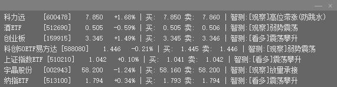

# StockTracker (潜行盯盘工具 - 大A定制版)

StockTracker 是一款专为 A 股定制的**极致隐蔽、智能高效**的潜行盯盘利器。它在保持水印级 UI 设计的同时，内置了深度适配大 A 盘口特征的“智测量化引擎”，助你在办公环境下低调、智能地洞察实时行情异动。

## 📸 效果预览



> **设计理念**：极致的透明度与暗色调，使其能完美融入 VS Code、PyCharm 等开发工具的深色背景中。

---

## ✨ 核心特性

### 1. 极致隐蔽的沉浸式 UI
- **无感存在**：无标题栏、无边框、不在系统任务栏显示图标，彻底杜绝被“瞄一眼”发现的风险。
- **水印级显示**：采用半透明黑色背景与深灰色字体，文字粗细经过调优，使其在深色编辑器背景上如同“系统水印”一般存在。
- **交互极简**：鼠标左键即可随意停放位置，右键呼出控制核心。

### 2. 智能防呆交互
- **纯数字输入**：添加股票时仅需输入 `6位数字代码`。引擎会自动补全前缀（sh/sz/bj）并识别所属板块（主板/创业板/科创板）。
- **本地持久化**：自选股列表实时加密保存在本地 `stocks.txt`，重启即恢复。

### 3. “智测”量化引擎 2.0 (Deep-A Logic)
程序每 3 秒刷新一次实时盘口，并进行实时预判：
- **⏳ 动态量比归一化 (Annualized Ratio)**：根据当前交易时间（排除午休）动态计算预估全天量级，彻底解决早盘量比失真的行业痛点。
- **📊 动态多板块阈值**：自动识别主板 (10%)、科创/创业板 (20%)、北交所 (30%) 涨跌停限制。
- **📈 趋势感应 (Trend-Aware)**：引入最近 5 日趋势斜率分析，有效区分“超跌反弹”与“趋势主升”。
- **📉 多维 K 线形态**：复现“仙人指路”、“金针探底”、“避雷针”等 A 股经典盘口语境，并加入十字星过滤逻辑。

---

## 📝 预测状态词典 (Dictionary)

智能引擎会根据当前盘口自动给出以下 20 余种深度解析：

### 🟢 强势/看多区间
| 状态词 | 盘口含义 |
| :--- | :--- |
| **爆量打板(分歧大/防炸)** | 封板瞬间量能过大，需防范“炸板”风险。 |
| **极度控盘(缩量一字)** | 极小量能封死涨停，筹码高度锁定，后续空间大。 |
| **强势封板** | 稳健的多头绝对掌控。 |
| **震荡试盘(仙人指路)** | 阳线长上影+趋势向上，主力拉升前的火力试探。 |
| **金针探底(爆量承接)** | 底部放量长下影，下跌动能衰竭，主力进场信号。 |
| **爆量主升** | 直线拉升，配合大成交量，多头情绪最高点。 |
| **缩量逼空** | 价格持续走高但卖盘枯竭，典型的主力高度控盘形态。 |
| **多头掌控** | 稳态上涨，趋势良好。 |

### 🟡 震荡/观察区间
| 状态词 | 盘口含义 |
| :--- | :--- |
| **回踩确认(洗盘结束)** | 价格缩量回调至 5 日线附近获得支撑。 |
| **高位滞涨** | 价格不涨但成交量剧增，需警惕主力派发。 |
| **缩量洗盘** | 波动收窄，量能萎缩，进入洗盘阶段。 |
| **震荡攀升** | 贴合 5 日均线温和上行。 |
| **蓄势震荡** | 成交量温和，主力在当前价位进行筹码交换。 |

### 🔴 弱势/看空区间
| 状态词 | 盘口含义 |
| :--- | :--- |
| **抛压巨大(避雷针)** | 高位放量长上影线，主力暴力出货，极大概率见顶。 |
| **恐慌跌停(放量杀跌)** | 恐慌性砸盘，尚未见底。 |
| **情绪雪崩(无量跌停)** | 毫无承接的单边下跌。 |
| **破位杀跌** | 跌破关键均线支撑且伴随放量。 |
| **阴跌不止** | 成交量极小但价格重心不断线下，买盘严重不足。 |
| **弱势反抽** | 均线下方的无量脉冲，通常是离场时机。 |
| **反弹受阻** | 上攻伴随长上影，缺乏多头合力。 |

---

## 🚀 部署与运行

### 编译单文件绿色版 (推荐)
直接在项目根目录下执行：

```powershell
dotnet publish -c Release -r win-x64 --self-contained true -p:PublishSingleFile=true -p:IncludeNativeLibrariesForSelfExtract=true -o publish
```

完成后，在 `publish` 文件夹提取 `StockTracker.exe` 即可。

---

## 🛠 技术栈
- **语言**：C# 13.0
- **运行时**：.NET 9.0 (Windows x64)
- **底层驱动**：Windows Forms (WinForms)
- **数据流**：Sina API (GB2312 编码适配)

---

## ⚖️ 免责条款 (Disclaimer)

**在使用本工具前，请务必阅读以下声明：**

1. **非投资建议**：本软件提供的“智测”结果、预测术语及各类行情分析仅作为技术逻辑的实验性展示，基于历史数据和特定数学模型，**不构成任何买入、卖出或持有股票的投资建议**。
2. **数据局限性**：由于网络延迟、API 刷新频率（3秒）及算法模型的固有随机性，软件展示的数据可能与实际成交盘口存在偏差。
3. **盈亏自负**：证券市场具有极高风险。用户依据本软件信息进行交易所产生的任何形式的资产损失（包括但不限于本金亏损、利润损失等），**作者及软件开发者不承担任何直接或间接的法律责任**。
4. **版权说明**：本软件仅供学习交流使用。禁止用于任何非法金融活动或违反相关证券从业监管规定。

**股市有风险，入市需谨慎。**
