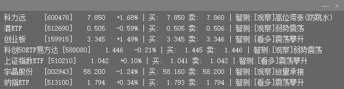

# StockTracker 📈
> **极客级潜行量化盯盘与 AI 自选个股分析 (Avalonia UI / .NET 9.0)**

   

StockTracker 是一款为 A 股量化交易极客量身定制的**跨平台、极度隐蔽的本地原生智能行情决策系统**。
它抛弃了臃肿的外部解析器，通过纯 `C# 极速原生内核` 提供桌面水印级的监控体验，更是首创性地内置了无感降级技术、本地高斯筹码运算，以及比肩顶级券商内参的 **AI 生成式大模型诊断仪表盘**。

---

## 📸 全息预览与视觉美学



> **🎭 极致伪装哲学**
> 界面零边框、全透明底纹。能无缝融合进 VS Code、PyCharm 或 IntelliJ IDEA 等开发工具的深色背景中。让您在敲代码、看文档、甚至开屏会议时，市场命脉依旧能在屏幕角落静默流淌，绝无破绽。

---

## 🔥 革命性核心能力 (Core Features)

### 1. 🤖 终极 AI 决策大模型研报引擎
StockTracker 彻底重构了个人投研工作流，一键连通 Gemini 等顶级 LLM，直接向您的邮箱投递**决策仪表盘级研报**：
- **🌍 宏观大盘温度层**：分析在开启对个股扫描前，强制嗅探上证/深成/创业板大盘环境。若遇大跌行情系统强制触发防守拦截警告。
- **🧮 极速本体 CYQ 仿真筹码测算**：不再低声下气请求被层层限流的三方云接口！直接在 C# 内存中拉取 200 个交易日量价阵列，不到 10 毫秒跑出极其锋利的：**获利占比 (%)**、**绝对平均持仓成本** 和 **单峰密集 90% 集中度**。
- **🏦 价值重构与深维财务护城河**：由智能引擎长驱直入东方财富深层利润源，抽提出 **ROE (净资产收益率)**、**归属净利润**、**全营业总收入** 和 **每股经营现金流** 四路基石数据，在纯技术的汪洋里死守价值防线。
- **📰 Tavily 全息舆情与主力资金交锋**：精确测量盘口 **单日主力大单净流入**，并融合全球顶级 Tavily AI 搜索引擎实时锁定该股近 3 日的突发黑天鹅/催化剂事件，让庄家的每一次异动无所遁形。

### 2. 🛡️ 工业级反爬盾与智能备灾降级 (Anti-Bot & Fallback)
天下没有永远稳定的数据源。StockTracker 将防御力推至极限：
- **随机量子 UA 轮换 (User-Agent Rotation)**：每一次向市场发起的行情嗅探，都会自动切换高匿名的主流浏览器头颅阵列，有效突破大数据高压探针。
- **东财/新浪/腾讯 三级容灾 (Multi-Tier Fallback)**：当深度接口 (如财报大宽表) 被彻底熔断时，网络层会在 `try-catch` 底层静默捕获，并**瞬间跌落回长期连接短报通道**获取核心保底值 (如只拿 PE 和主权 ROE)。分析线程**永不宕机**，前端界面**永不崩坏**！昨日量价异常依然可用。

### 3. 🧠 Deep-A 本地智测算法体系
无需调取 AI，其内置实时 C# 判断循环已足够硬核：
- **高频量能扫描**：实时解构时间加权量比，结合**精准锁定前日量能的绝对倒数推演**，第一时间报警 `量能>2.0` 的异动拉板或高位派发。
- **K 线形态原理解剖**：精筛针点：带量长下影判定【金针探底】，缩量多头探上影认定【仙人指路】；破位大跌则亮起血红【避雷针】警告。
- **多数据源协同的选股打捞**：独立一键选股扫盘引擎，自动排除劣质票（高 PE 垃圾股、巨型市值），仅把当前盘口量比最狂野的标的推入您的自选池。

---

## 📦 开箱即用：纯正的“单文件”便携艺术
软件已被打磨为完整的 **Self-Contained (独立包含)** 发行版。
**无需配置任何 Python 环境、无需独立安装繁琐的 .NET 运行时 SDK**：把体积轻盈的那个 `exe` （或 Unix 执行档）丢在自带 U盘里，双击，就是整个世界。

| 支持的系统生态 | 一键下载通道 | 运行建议 |
| :--- | :--- | :--- |
| **🪟 Windows (64位)** | [下载 StockTracker.exe](https://github.com/Joker-smile/StockTracker/raw/master/publish/win-x64/StockTracker.exe) | 下载双击即开，生成的配置文件始终跟随主程序。 |
| **🍎 macOS (M系 Apple Silicon)** | [下载 StockTracker](https://github.com/Joker-smile/StockTracker/raw/master/publish/osx-arm64/StockTracker) | M1/M2/M3/M4 全制霸，原生图形加速。 |
| **💻 macOS (Intel CPU)** | [下载 StockTracker](https://github.com/Joker-smile/StockTracker/raw/master/publish/osx-x64/StockTracker) | 稳定支持所有存量 Intel 系列架构 Mac。 |

> [!TIP]
> **🍎 针对 Mac 玩家的“消灭黑框终端”秘籍：**
> 如果您不想双击时带着一个黑洞洞的 Terminal，请花 **三十秒** 进行绝地伪装：
> 1. 新建名为 `StockTracker.app` 的文件夹（它会立刻变成应用图标）。
> 2. 右键单击，选 **显示包内容**，进去建 `Contents` 文件夹。
> 3. 再进去建 `MacOS` 文件夹。把下载的文件直接丢到 `MacOS` 里面。
> 好了！现在去桌面双击，干干净净，没有黑框！（如遇执行权限卡顿，可在终端补射一枪：`chmod +x StockTracker.app/Contents/MacOS/StockTracker` 即刻起飞）

---

## 🖱️ 全局操作航线指引

StockTracker 的一切功能，隐藏在绝对极简的鼠标事件中。

- **隐形漂移 (Window Move)**：左键按住全宇宙任意黑色空白区域，拖着它走！
- **唤醒全能主控舱 (右键菜单)**：
  - `⚙️ 设置 (Settings)`：配置核心的 AI Gemini 密锁、Tavily API 检索秘钥，以及你的私人接收邮箱与 SMTP 配置流。你也可以定制轮询定时器。
  - `🚀 自动生成大盘及个股顶级研报 (Run AI)`：一键即时触发全盘检索，生成极其深度的可视化研报直接投递您手机。
  - `➕ 添加 / 删除 / 清空`：优雅管理自选池，完美兼容 A 股及 ETF 代码前缀解析。
  - `📊 数据源灾备重定向`：支持核心盘口切流（东财路线 或 腾讯兜底路线）。
  - `关闭 / 最小化`：只有在你鼠标非常靠近界面右上角时，才会从量子虚空中渐隐而出两个小红点与小黄点。

---

## 🛠️ 纯血重型源码构建 (Developer Compile Guide)

本项目证明了极高并发吞吐数据量下 `.NET 9.0` 和 `Avalonia UI 11.0` 的开发生产力属于降维打击。
根目录自带自动化发布脚本 `init.bat`，或采用手工原生命令：

```bash
# 编织 Windows 版本:
dotnet publish -c Release -r win-x64 --self-contained true -p:PublishSingleFile=true -o publish/win-x64

# 锻造 Mac ARM 战甲:
dotnet publish -c Release -r osx-arm64 --self-contained true -p:PublishSingleFile=true -o publish/osx-arm64
```

---

## 🛡️ License 与防封声明
`StockTracker` 的初衷在于验证 AvaloniaUI 的跨平台渲染极限与 C# LINQ 在极速计算阵列中的优势，完全开源并谢绝商用。
项目中涉及的新浪、东方财富、腾讯等端口均已挂载多级 fallback 防崩逃逸路线，但所请求数据不对投资构成实质性建议。
**市场极其凶险，请只用理性的规律和数据去战胜恐惧。**
